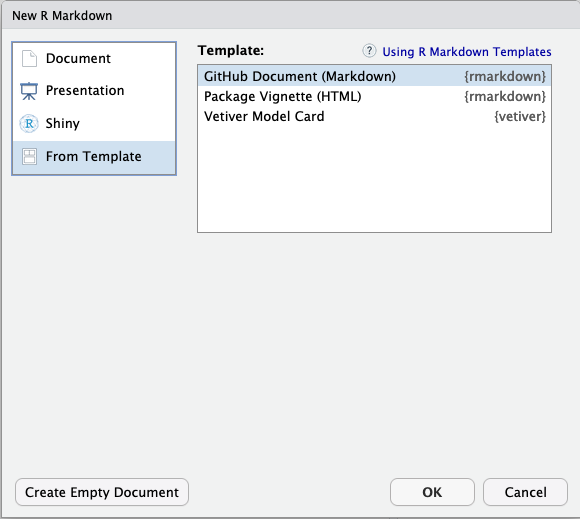

```{r, include = FALSE}
knitr::opts_chunk$set(
  collapse = TRUE,
  comment = "#>"
)
```


## What is a "Model Card"?

Good documentation helps us make sense of software, know when and how to use it, and understand its purpose. The same can be true of documentation or reporting for a deployed model, but it can be hard to know where to start. The paper ["Model Cards for Model Reporting" (Mitchell et al. 2019)](https://doi.org/10.1145/3287560.3287596) provides a suggested framework for organizing and presenting the essential facts about a deployed machine learning model. The vetiver package provides an R Markdown template for creating a "Model Card" for a published vetiver model. The template **automates** extracting some information from the model object, and provides **structure** for the model developer where automation is not possible.

Model developers see a nudge to create a model card when they publish a model; we recommend that you create a model card when you deploy a model for the first time and refresh that model card as needed when new versions are deployed.

```{r setup}
library(vetiver)
library(pins)
model_board <- board_temp()

cars_lm <- lm(mpg ~ ., data = mtcars)
v <- vetiver_model(cars_lm, "cars_linear")
vetiver_pin_write(model_board, v)
```

(Learn more [about silencing messages like this if desired.](https://rlang.r-lib.org/reference/abort.html#muffling-and-silencing-conditions))

## Accessing the template

To use the vetiver model card template from RStudio, access through `File -> New File -> R Markdown`. This will open the dialog box where you can select from one of the available templates:


    
 
If you are not using RStudio, you'll also need to install [Pandoc](https://pandoc.org). Then, use the `rmarkdown::draft()` function to create the model card:

```r
rmarkdown::draft(
    "my_model_card.Rmd", 
    template = "vetiver_model_card", 
    package = "vetiver"
)
```

## Model card outline

There are several sections in the model card framework used here.

- **Model details:** Some details about your model can be determined from the model object itself, but some (like who developed the model and license or citation information) need to be provided by you.

- **Intended use:** Outline the intended use and users of the model, and perhaps also what types of use would be out of scope.

- **Important aspects/factors:** What are the demographic, environmental, technical, or other aspects that are relevant to the context of the model?

- **Performance metrics:** Communicate which metrics are being used to evaluate the model, and why these are a good fit for the model's context and domain.

- **Training data & evaluation data:** Some specific dataset was used to train the model, so be sure to share basic details about its characteristics. (Some information about the training data can be extracted from the model object itself.) Some (probably different) specific dataset is used to _evaluate_ the model in the context of the model card, so also explain what the evaluation data is like.

- **Quantitative analyses:** Provide the results of evaluating the model using your chosen metrics and the evaluation data. Be sure to present both overall results (for the dataset as a whole) and disaggregated results, especially with any aspects (demographic, environmental, or other) in mind that have been identified as important for this model. You can use both tables and visualization to present these quantitative analyses.

- **Ethical considerations:** Share ethical considerations and any possible solutions considered. Some specific aspects to note are any sensitive data used, impact on human life, possible risks and harms, and important use cases.

- **Caveats & recommendations:** As the model developer, you likely have the most domain knowledge of what the model can and cannot do. This section is a good place to share any additional thoughts, perhaps including how your own identity may or may not come into play in the model's context.

## Can't I just delete the section on ethical considerations?

It's possible that a given machine learning model may not have obvious caveats, ethical challenges, or demographic aspects, or that they are largely unknown. However, we strongly advise that instead of deleting any such section because you have incomplete or imprecise information, you note your own process and considerations. Also, consider the possibility of gathering feedback from those impacted by the machine learning system, especially those with marginalized identities.

The process of documenting the extent and limits of a machine learning system is part of transparent, responsible reporting. A model card framework such as this is a helpful tool and some parts of a model card can be automated, but ultimately the extent of its value depends on you. From Mitchell et al. (2019):

> Therefore the usefulness and accuracy of a model card relies on the integrity of the creator(s) of the card itself.

